# UX review: background work, Agents tab, lineage, `@` sessions

Reviewed on `main` at `72aa9335` (after #366, #368, #370, #371, #372), 4 October 2026. Review only: no application
code changed. Screenshots are of the real app on a scratch Fleet; the decision mockups are in
`mockups/ux-review-background-work/index.html` (rendered as `d1`–`d4` PNGs next to it).

## Verdict

Each piece is tidy, follows the design you picked (`mockups/background-work-lineage`, option A plus C's counter), and
**stays out of the way on a quiet day**: with nothing running, a session, the list, the status bar and a fresh
install look exactly as before the batch. Keyboard focus works through the strip and the counter's popover.

The trouble is the busy day. The pieces were designed one at a time, and together they say the same thing in up to
five places: one running subagent is a tool card, a strip row, a session-list row (plus a chip on its parent), an
Agents-tab row and a status-bar popover row, each with its own controls. The same session gets three different
"running" counts, and the same thing four names. That's where Fleet gets busier, and it's mostly a design question
(four decisions below), not polish.

Separately, four things are plain bugs or misreads that should be fixed whatever is decided: a Claude Code subagent's
session takes messages it can never send; Stop is an empty square that reads as a checkbox; on a phone the lineage
pill squeezes the title to five letters; and on a phone the Agents tab leaves out forks and started sessions.

| | Fix now (small, no new design) | Needs your decision |
|---|---|---|
| 1 | Read-only Claude Code subagent sessions accept messages | **D1** Where running work shows (one home per scope) |
| 2 | Stop looks like a checkbox | **D2** How loud a nested row's label is |
| 3 | Phone: the lineage pill crushes the title | **D3** How long finished work stays in the strip |
| 4 | Phone: Agents tab misses forks and started sessions | **D4** One word per thing |
| 5 | Claude Code background calls read "done" while running | |
| 6 | One Stop, three words (stopped / cancelled / error) | |
| 7 | Agents tab added where nothing runs, pushing Files out | |
| 8 | Seconds tick in four places | |
| 9 | Small copy: `@` footer names a tool, "0s ago", "Agent" | |
| 10 | Home's "Working 3" counts sessions its own list hides | |

## How this was checked

- Scratch Fleet (`main`, Debug API + built client, scratch `HOME`, port 5391) with OpenCode 2 on a scripted model and
  real Claude Code (Haiku). Three projects, 12 sessions: seven quiet ones; *What can we learn from t3code?* whose agent
  started *Capture Claude Code subagents* through Fleet's API; that session ran two background shells, a running and a
  finished subagent, started *Fix Pi model switch*, and was forked (*Fork: emit jobs over SignalR*, kept working); a
  Claude Code session with a background shell, a Monitor and a background subagent (its own child session); an `@`
  reference sent from *Fix Pi model switch*. Then everything stopped, and a second, empty Fleet for the fresh install.
  Pi was left out: the machine has 7 GB and other sessions were building; its strip rows are the same component
  (`mockups/pi-running-work`).
- Playwright Chromium at 1440×900 and 390×844, dark and light. Probes: Tab order through the strip and counter;
  conversation and composer positions sampled every 0.5 s while a short background shell started, finished and left
  the strip; typing and sending in a Claude Code subagent's session.
- Compared with the before shots in `mockups/background-strip`, `mockups/agents-tab` and `mockups/at-sessions`.
- Kit: `~/.cache/fleet-ux-review` (`fleet.sh start|fresh|stop`, `seed.py quiet|projects|lineage|claude`,
  `quiet.mjs`, `busy.mjs`, `probe.mjs`, `render.mjs`).

### The quiet day (nothing to fix)

Nothing from the batch shows when nothing runs: no strip, no counter, no chips, no Agents tab on a session that never
started anything. The fresh install is unchanged.

| Idle session (dark) | Idle session (light) | Fresh install |
|---|---|---|
| 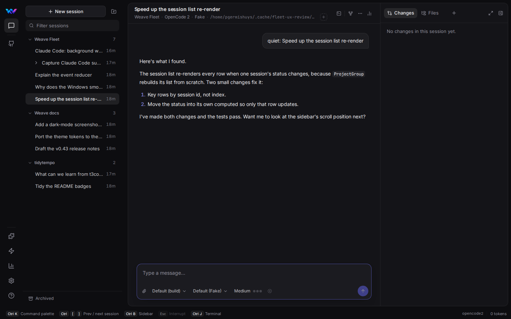 | 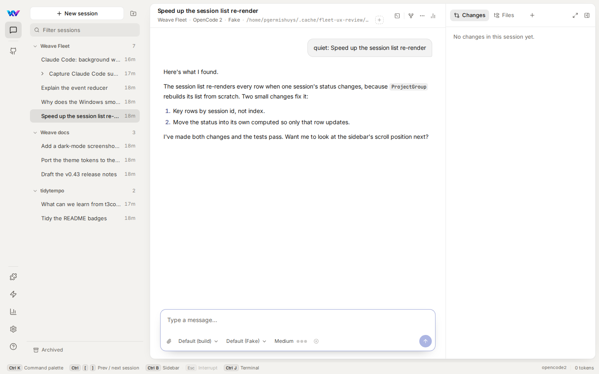 | 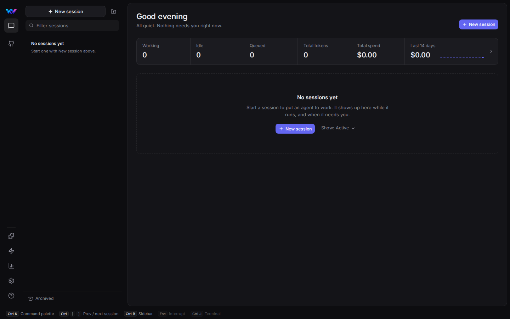 |

### The busy day

| Session with work (dark) | (light) | Phone |
|---|---|---|
| 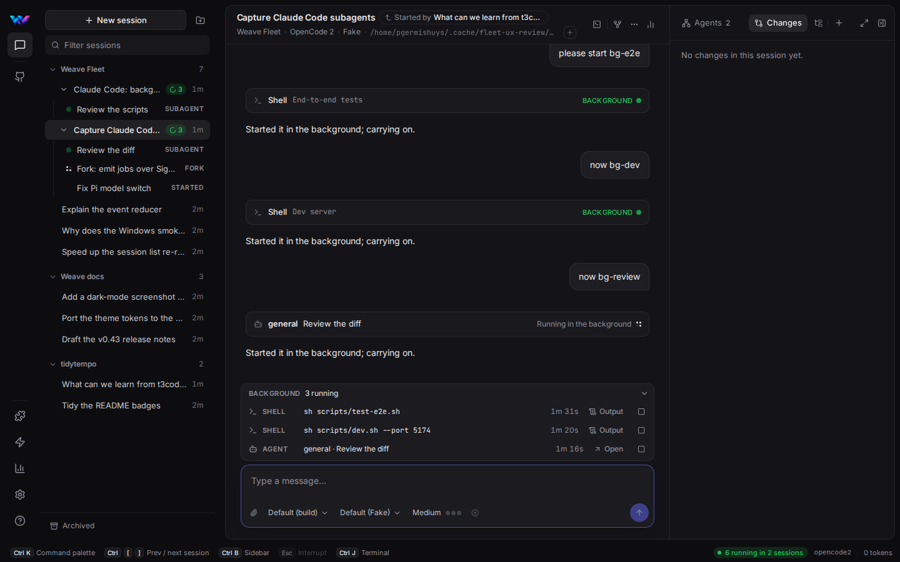 | 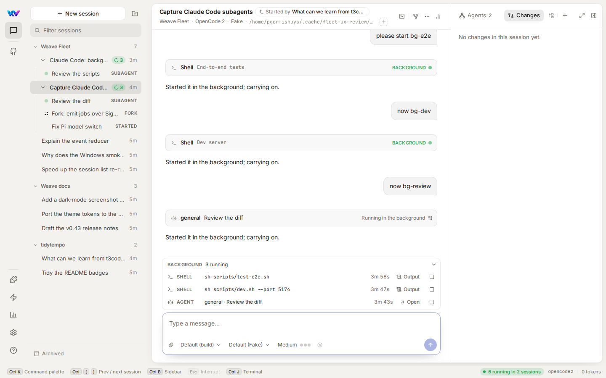 | 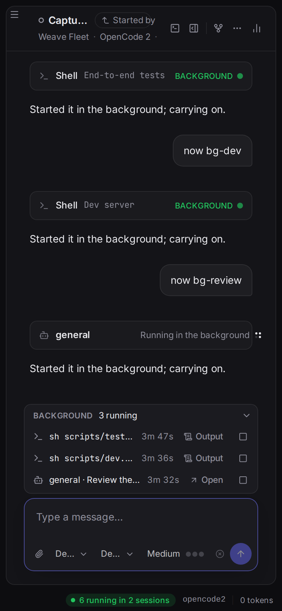 |

---

## Fix now

Ranked by how much they hurt. Each is small and doesn't change the chosen design.

### 1. A Claude Code subagent's session takes messages it can never send

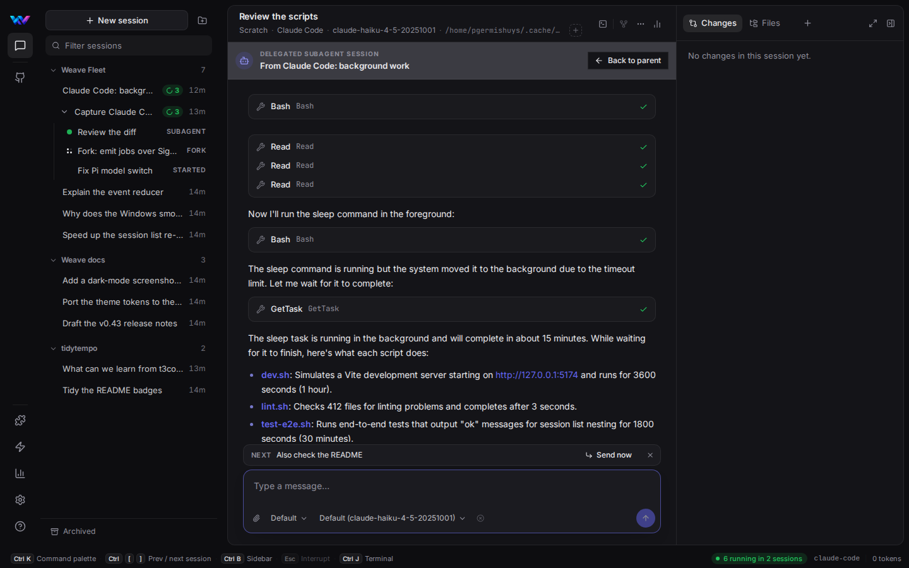

**What's wrong.** The child session of a Claude Code subagent (#371) shows the full composer with model chips. Typing
and pressing Enter queues the message (*NEXT Also check the README*) and it sits there for good: the session goes
idle and the queue never sends. *Send now* then fails with the right explanation, in red, while the message stays
queued:

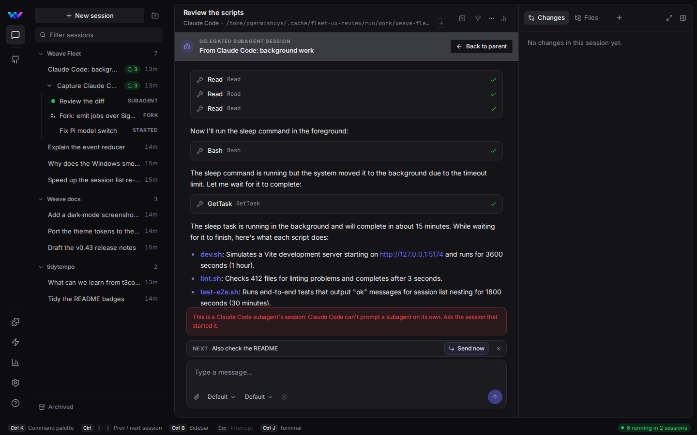

The server already knows: `ClaudeCodeHarness` has `ChildSessionsResumable = false` and
`ClaudeCodeHarnessSession` throws *"Claude Code can't prompt a subagent on its own"*. But the session's
`capabilities.canPrompt` is `true`, so the client offers the composer. (Pi has `ChildSessionsResumable = false` too,
but its subagents have no child session.)

**Change.** Session capabilities: `canPrompt = false` with that sentence as `promptDisabledReason` when the session has
a parent and its harness's children aren't resumable. In place of the composer, one muted line: *"This is a subagent
of Claude Code: background work. Ask there."* with the existing *Back to parent*. Test it at the API layer
(capabilities for a Claude Code child) and in a component test (no composer when `canPrompt` is false).

### 2. Stop is an empty square, and reads as a checkbox

| Running: the right-hand column | Stopped: the left-hand column |
|---|---|
| 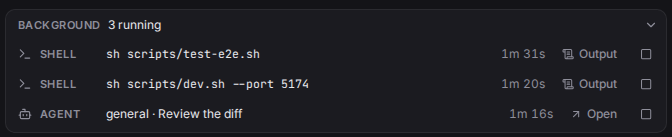 | 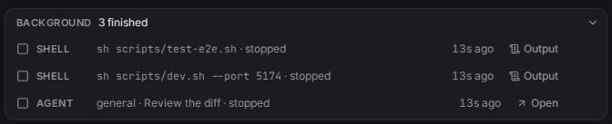 |

**What's wrong.** The strip's (and the popover's) Stop button is lucide's `Square` with no label, at the end of the row,
so a busy strip ends in a column of checkboxes. After a stop, the same empty square becomes the row's status icon on
the left, and a strip of stopped work looks like an unticked to-do list. The Agents tab gets this right: a labelled
*Stop* button.

**Change.** Stop button: `CircleStop` (or a filled square) with the word *Stop* where the row has room (the strip's
container query already drops the kind word on narrow strips; drop the word there too), and the tooltip as now. The
stopped status icon: a muted `CircleSlash`/`Ban`, not a square. No new design: it's the control the Agents tab
already uses.

### 3. Phone: the "Started by / Forked from" pill crushes the title

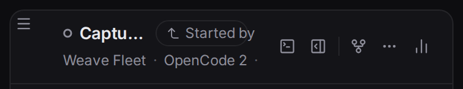

**What's wrong.** At 390 px the pill takes the header's room: the title shows as *Captu…* and the pill itself is cut
after *Started by*, so neither reads. Desktop is fine.

**Change.** Below the header's existing 716 px breakpoint, show the pill as its icon only (the `title` already names
the session; give it an `aria-label` too). The lineage-detach PR keeps the pill as the way to the exact parent, so
this keeps it, just smaller.

### 4. Phone: the Agents tab leaves out forks and started sessions

| Phone, straight to the Agents tab | Desktop, same session, same moment |
|---|---|
| 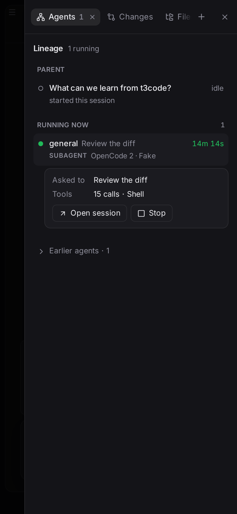 | 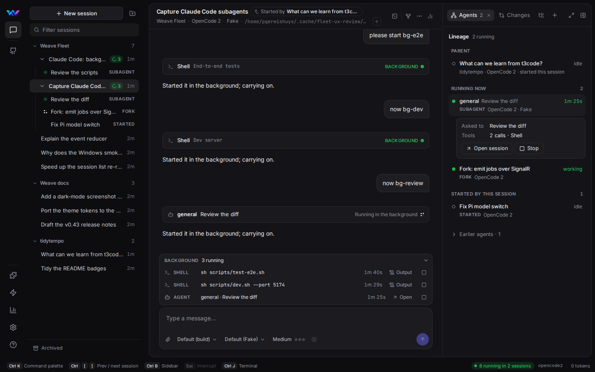 |

**What's wrong.** Opened on a phone, the tab shows *1 running* (the subagent) and nothing under *Started by this
session*; the fork and *Fix Pi model switch* are missing, and the parent has no project or harness line. After opening
the menu drawer once and coming back, the same tab shows *2 running*, the fork and the started session (checked:
`probe` output A vs B). Forks and started sessions come from the session list, which the phone only loads when the
drawer opens.

**Change.** `useSessionLineage` makes sure the session list is loaded (the store's existing fetch), whatever the
sidebar is doing. Test: mount the Agents canvas with an empty session store and assert it asks for the list.

### 5. Claude Code's background calls read "done" in the conversation while they still run

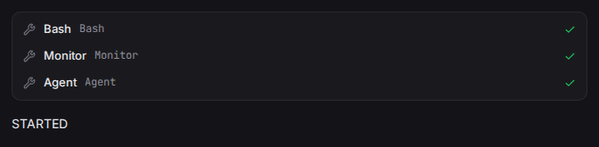

**What's wrong.** In the Claude Code session, the three calls that started a background shell, a Monitor and a
subagent each show a green tick while the strip right below says all three are running. OpenCode 2's cards for the
same thing say *Background* (shells) and *Running in the background* (subagents), so the two harnesses disagree, and
for Claude Code the conversation contradicts the strip. The cards are also generic (*Bash Bash*, *Agent Agent*) where
OpenCode 2's say *Shell · End-to-end tests* and *general · Review the diff*.

**Change.** When a Claude Code call has a running work item (`toolCallId` matches), draw it with the same
*Background* state OpenCode 2 uses. The generic titles are older than this batch; worth a follow-up, not this fix.

### 6. One Stop, three words

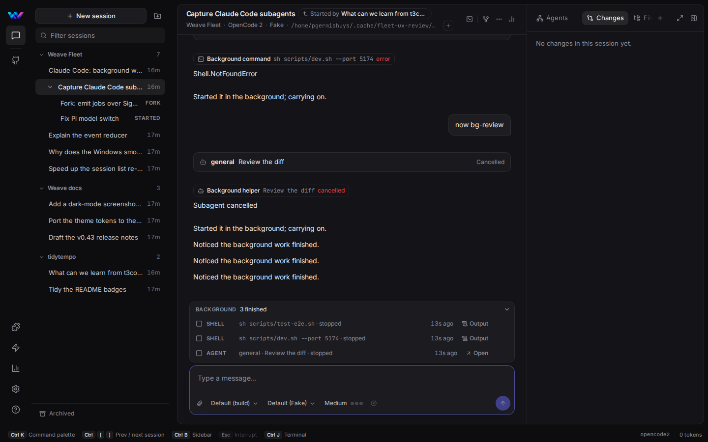

**What's wrong.** Stopping the two shells and the subagent from the strip: the strip says *stopped*, the subagent's
card says *Cancelled* and its result card *cancelled*, and the dev server's card says *error* with
`Shell.NotFoundError` in red. Something you did on purpose reads as a failure.

**Change.** Fleet knows it stopped the item (`endedReason = cancelled` from `StopWorkAsync`). Word it *stopped*
everywhere a work item's state shows, and don't draw a shell Fleet stopped as an error (OpenCode 2 reports the
shell it was told to kill as not found).

### 7. The Agents tab is added where nothing runs, and pushes Files out

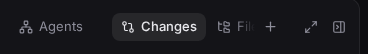

**What's wrong.** *What can we learn from t3code?* only ever started one session, which is idle. It still gets an
*Agents* tab, added first, and at the default panel width *Files* is cut to *Fil…*
(`SessionsV2RightPanel.vue` introduces the tab when the session has any lineage at all, running or not).

**Change.** Introduce the tab the first time something in it is running or waiting on you (`activeCount > 0`), not
when there's only history. It stays one click away under *+* and the header pill still links the parent. That's the
"nothing shown at zero" rule. (The design doc says "added the first time the agent starts a subagent or another
session"; this narrows *starts* to *has running*.)

### 8. Seconds tick in four places at once

**What's wrong.** On a busy screen, every strip row, every popover row, the Agents-tab row and the *Working ·* line
count seconds (`TICK_MS = 1_000`, `formatElapsed` shows `4m 7s`). Four or five numbers changing every second pull the
eye away from the conversation; the session list, next to them, says `4m` and changes once a minute.

**Change.** `formatElapsed`: seconds only in the first minute, then whole minutes (`4m`, `1h 12m`), and tick once a
minute after the first. The tooltip keeps the exact start time.

### 9. Small copy

- The `@` picker's footer says the agent *"reads what it needs with fleet_session_read"*: an internal tool name in the
  UI. Say *"The agent gets a link to the session, not a copy, and reads what it needs."*
  ([picker](../../mockups/ux-review-background-work/shots/at-dark-picker.png); the sent chip is clean:
  [sent](../../mockups/ux-review-background-work/shots/at-dark-sent.png).)
- A finished row says *0s ago*. Say *just now* under a minute.
- The strip calls a subagent *Agent*; the session list and the Agents tab call it *Subagent*, and so does the work
  model (`kind: subagent`). Use *Subagent* in the strip. (D4 covers the bigger naming question.)
- Phone: OpenCode 2's subagent card draws its working dots outside its border at 390 px
  ([phone](../../mockups/ux-review-background-work/shots/busy-light-phone.png)).

### 10. Home's "Working 3" counts sessions its own list hides

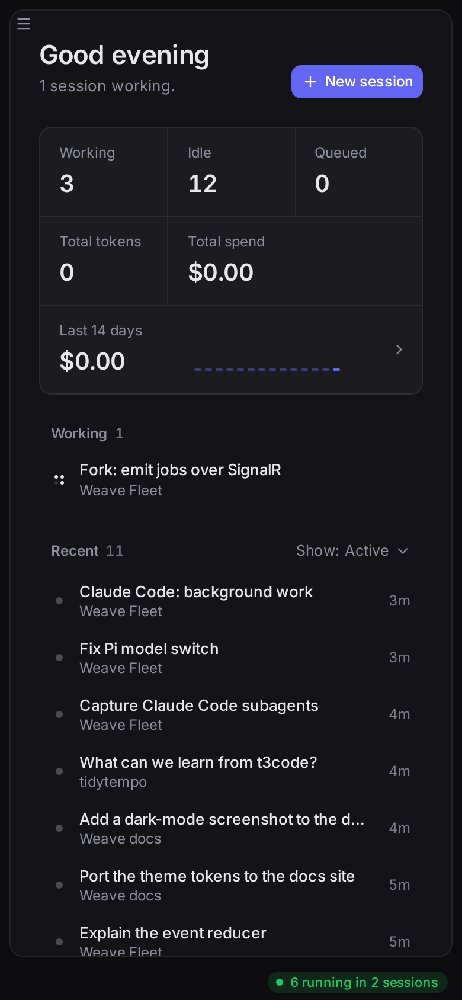

**What's wrong.** With the fork busy and two subagents running, the home page says *Working 3* in the summary,
*1 session working* in the greeting and lists 1 under *Working*; the status bar says *6 running in 2 sessions*. The
summary's count (`activeSessions` from the server) includes subagent child sessions (here the OpenCode 2 and Claude
Code subagents), which the list under it filters out (`parentSessionId`).

**Change.** Count the same sessions the list shows (no child sessions). Background work stays the status bar's job.

---

## Needs your decision

Each has a mockup with options (`mockups/ux-review-background-work/index.html`, open it in a browser; the button top
right switches theme) and a recommendation. Rendered: `d1-dark.png` … `d4-light.png`.

### D1. Where running work shows: one home per scope *(recommended: B)*

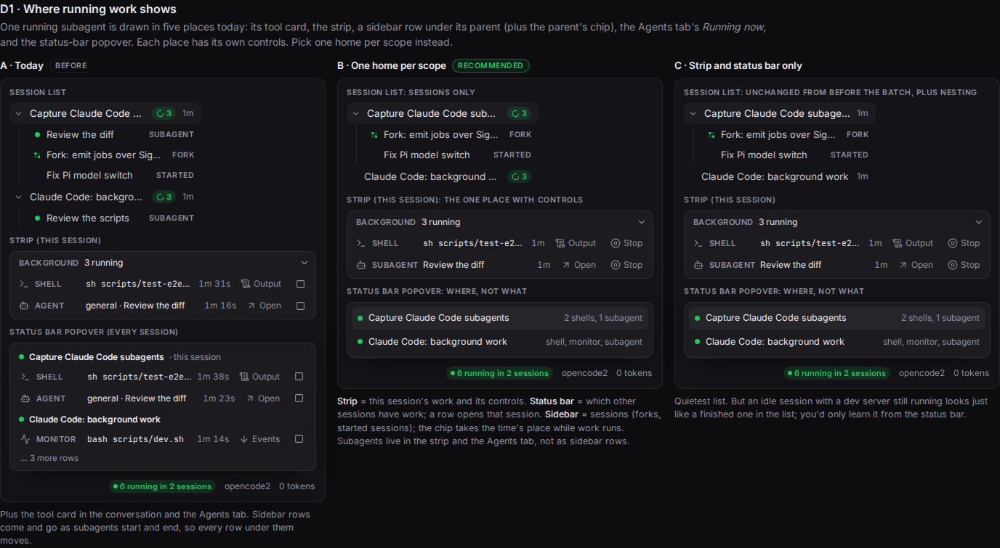

**What's wrong.** The *Review the diff* subagent, at one moment:

1. its tool card in the conversation (*Running in the background*),
2. a row in the strip (with Open and Stop),
3. a row under its parent in the session list, plus a *3* chip on the parent,
4. a row under *Running now* in the Agents tab (with Open session and Stop),
5. a row in the status-bar popover (with Open and Stop) — the strip again, controls and all, for every session.

| Strip | Status-bar popover | Agents tab | Session list |
|---|---|---|---|
|  | 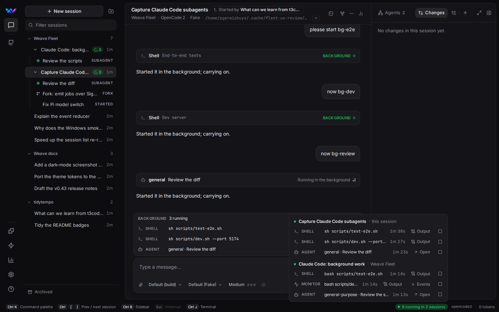 |  | 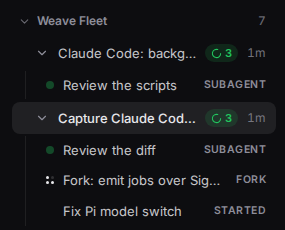 |

The counts disagree too: the chip and strip say *3 running*, the Agents tab *2 running* (it counts the fork that's
working, not the shells), the status bar *6 running in 2 sessions*. And the session list moves on its own: a running
subagent's row appears under its parent when it starts and goes when it ends (the Claude Code session's *Review the
scripts* row and its caret vanished when it finished), shifting every row below.

**Options.**
- **A · Today.** Five places.
- **B · One home per scope** *(recommended)*. The **strip** is this session's work and the one place with its
  controls. The **status bar** is the other sessions: its popover lists sessions (*Capture Claude Code subagents —
  2 shells, 1 subagent*), a row opens that session. The **session list** holds sessions only: forks and started
  sessions nest; subagents don't get rows (they're in the strip and the Agents tab); the parent's chip takes the
  time's place while work runs. The **Agents tab** stays as the on-demand lineage.
- **C · Strip and status bar only.** As B, without the chip. Quietest, but an idle session with a dev server still
  running looks finished in the list.

**Why B.** Each surface answers one question (what's running *here*, *where else*, *which sessions*), nothing shows
twice with controls, and the list stops jumping. It keeps everything you chose; it removes the copies.

**Overlap.** The lineage-detach session (`feat/lineage-detach-depth`) already treats a subagent's row as different
(no menu item, can't be dragged out, "it belongs to its parent's turn"). Taking subagent rows out of the list fits
that; forks and started sessions keep one level of nesting and detach by drag, menu and undo, as that PR has them.

### D2. How loud a nested row's label is *(recommended: B)*

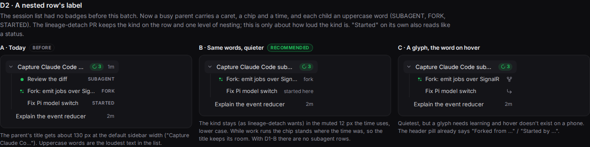

**What's wrong.** The list had no badges before this batch. A busy parent now has caret, title, chip and time; at the
default sidebar width its title gets about 130 px (*Capture Claude Co…*). Each child ends in an uppercase,
letter-spaced word (SUBAGENT, FORK, STARTED), the loudest text in the list. *Started* alone reads like a status (as in
"it started") rather than "a session this one started".

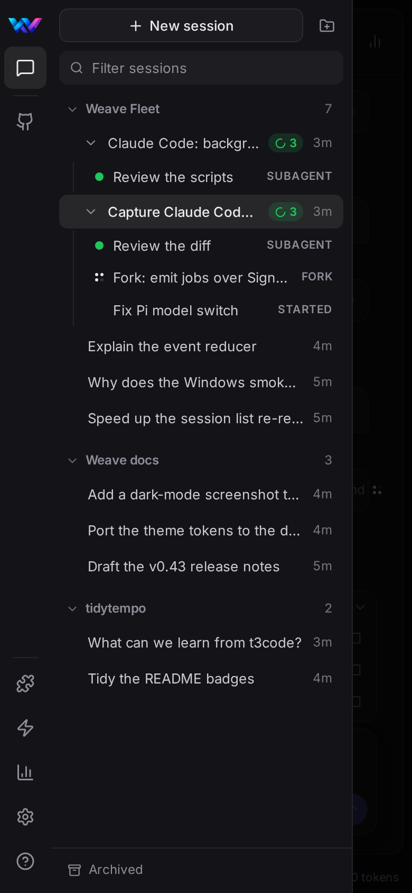

**Options.**
- **A · Today.**
- **B · Same words, quieter** *(recommended)*: lower case in the muted 12 px the time uses (*fork*, *started here*),
  and the chip stands where the time was while work runs, so the title keeps its room.
- **C · A glyph** (fork, corner arrow), the word in the tooltip. Quietest, but needs learning and there's no hover on
  a phone.

**Why B.** The lineage-detach design keeps the kind on the row; B keeps it and turns the volume down to the level of
everything else on the row.

**Overlap.** Same rows the lineage-detach PR is changing; this only restyles the label, so it can land after it.

### D3. How long finished work stays in the strip *(recommended: C)*

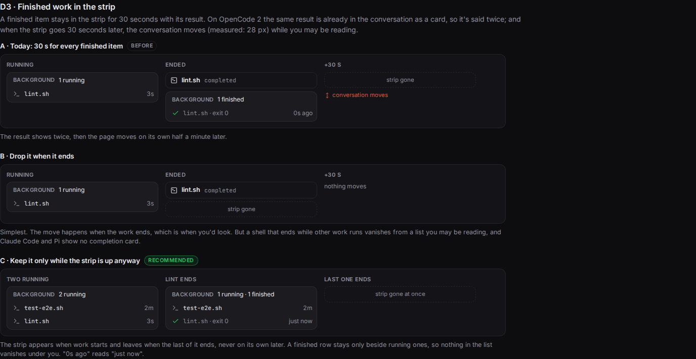

**What's wrong.** A finished item stays 30 s (`FINISHED_VISIBLE_MS`) with its result. On OpenCode 2 the conversation
already has the result card (*Background command · sh scripts/lint.sh · completed*), so it's said twice, and 30 s
later the strip leaves on its own and the conversation moves under you. Measured with a 3 s background shell in a
quiet session: the composer never moves (good), the last message moved 28 px when the strip left at 34.5 s.

| Running | Finished (said twice) | 30 s later (moved) |
|---|---|---|
| 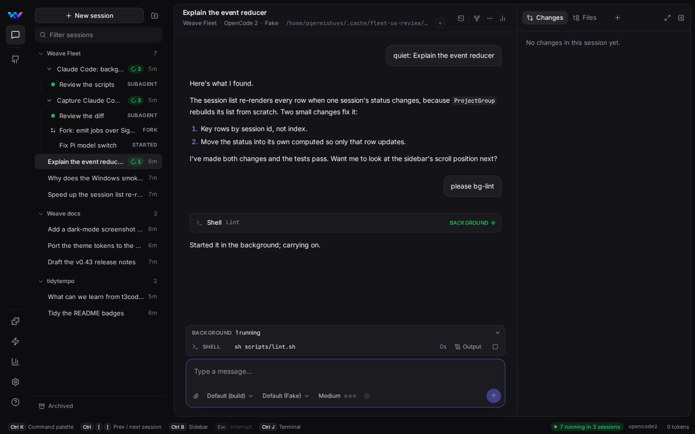 | 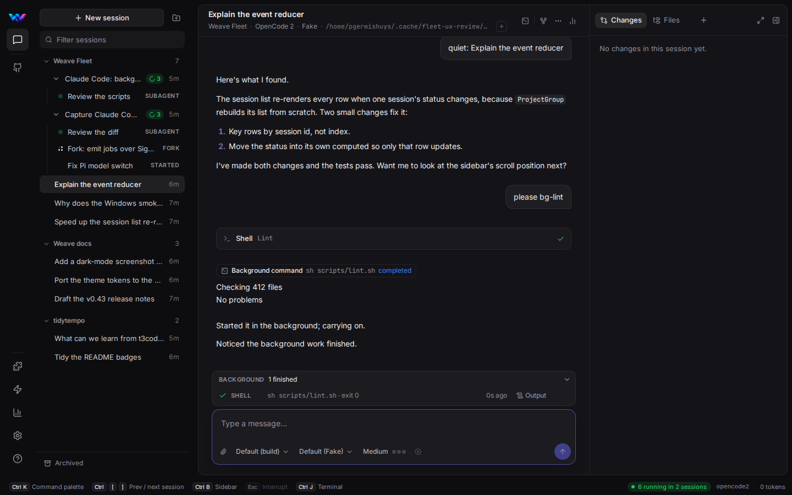 | 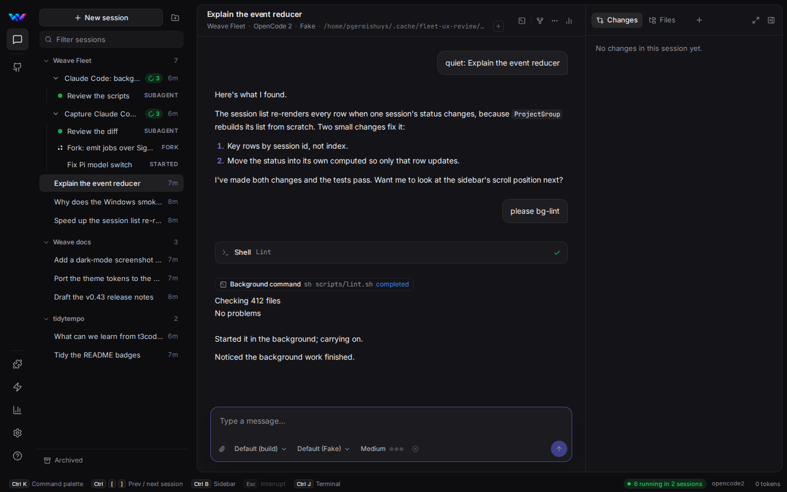 |

**Options.**
- **A · Today**: 30 s for every finished item.
- **B · Drop it when it ends.** Simplest, but an item that ends while others run vanishes from a list you may be
  reading, and Claude Code and Pi have no completion card to fall back on.
- **C · Keep a finished row only while the strip is up anyway** *(recommended)*: the strip appears when work starts and
  leaves when the last of it ends, never on its own later; a finished row stays beside running ones.

**Why C.** The strip never appears or moves the page just to show a result. Trade-off: when the last item ends, its
result is only in the conversation (and the Agents tab, for subagents); on Claude Code that's the agent's reply to the
notification.

### D4. One word per thing *(recommended: B)*

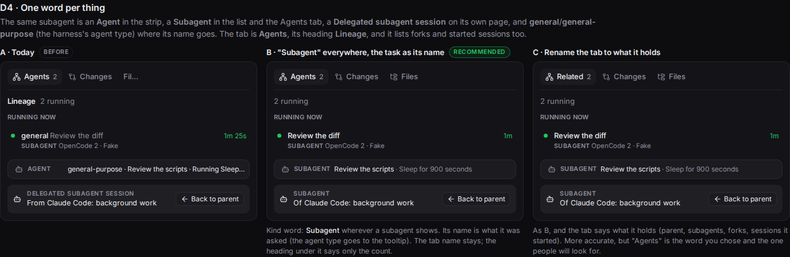

**What's wrong.** One subagent is an *Agent* (strip), a *Subagent* (list, Agents tab), a *Delegated subagent session*
(its own page) and, where its name goes, *general* or *general-purpose* (the harness's agent type, which says
nothing). The tab is *Agents*, the heading under it *Lineage*, and it lists forks and started sessions too. The strip
shows *general-purpose · Review the scripts · Running Sleep for 900 seconds in…*: three things where one would do.

**Options.**
- **A · Today.**
- **B · "Subagent" everywhere; the task is its name** *(recommended)*. The kind is *Subagent* wherever one shows; its
  name is what it was asked (*Review the diff*), the agent type in the tooltip; the Agents tab keeps its name and the
  heading under it says only *2 running*; the child page's banner says *Subagent · of Claude Code: background work*.
- **C · As B, and rename the tab *Related***, since it holds the parent, forks and started sessions too. More
  accurate, but *Agents* is the word you chose and the one people will look for.

**Why B.** Fewest new words, and each thing gets one. The strip's *Agent* → *Subagent* is already in Fix now (9).

---

## Checked and fine

- **Quiet day and fresh install:** nothing new shows (above). The status-bar counter is hidden at zero, chips go when
  work ends, the strip goes when nothing ran in the last 30 s.
- **Strip collapsed** is one line and remembered. ([shot](../../mockups/ux-review-background-work/shots/busy-dark-strip-collapsed.png))
- **Output** opens inline under its row and follows the tail.
  ([dark](../../mockups/ux-review-background-work/shots/busy-dark-output.png),
  [light](../../mockups/ux-review-background-work/shots/busy-light-output.png))
- **Keyboard:** Tab goes header → Output → Stop per row → composer, with a visible ring; Stop's `aria-label` names the
  item; the counter opens with Enter and focus moves into the popover.
  ([focus](../../mockups/ux-review-background-work/shots/focus-dark-strip.png))
- **`@` sessions:** the picker is one group with a clear footer (copy aside, 9), the sent chip is quiet, and the
  `<fleet-session-references>` block stays hidden. ([picker light](../../mockups/ux-review-background-work/shots/at-light-picker.png))
- **Phone strip:** the kind word drops at narrow widths and rows fit at 390 px.
  ([dark](../../mockups/ux-review-background-work/shots/busy-dark-phone.png),
  [light](../../mockups/ux-review-background-work/shots/busy-light-phone.png))
- **Light theme:** no contrast problems found in the new pieces.
  ([counter](../../mockups/ux-review-background-work/shots/busy-light-counter.png),
  [Agents](../../mockups/ux-review-background-work/shots/busy-light-agents.png),
  [Claude Code](../../mockups/ux-review-background-work/shots/claude-light-session.png))

## Not covered

- Pi (same strip component; see `mockups/pi-running-work`). Claude Code's *Started by* (it has no Fleet tools yet, so
  its sessions never get one).
- Very long lists (50+ sessions) and very many items in one strip.
- Screen readers beyond the labels above.
